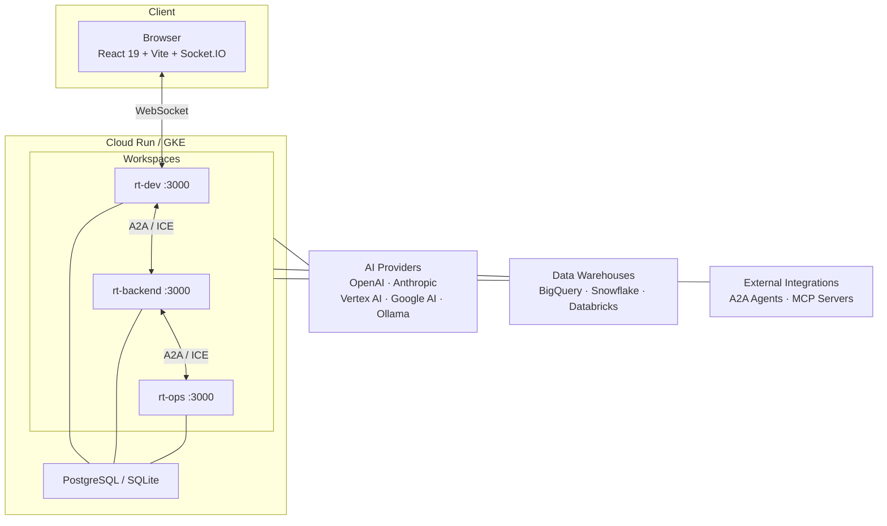

# 🎙️ Roundtable

**Real-time multiplayer AI workspace platform.**

Multiple users collaborate on AI conversations in real-time — with built-in tools for querying data warehouses, executing code, and managing files. Each workspace is an isolated container with its own AI, tools, and persistent storage.

[](LICENSE)
[](#testing)
[](#prerequisites)
[](https://github.com/foxtrotcommunications/foxtrotcommunications-roundtable-core/actions/workflows/ci.yml)

> **Production** — [roundtable.foxtrotcommunications.net](https://roundtable.foxtrotcommunications.net)

---

## Quick Start

**Zero config. No database. No `.env` file.**

```bash
git clone https://github.com/foxtrotcommunications/foxtrotcommunications-roundtable-core.git
cd foxtrotcommunications-roundtable-core
npm install
npm run dev

# Open http://localhost:3000
```

Roundtable auto-detects the environment: if no `DATABASE_URL` is set, it uses SQLite and in-memory sessions for instant local development.

### Deployment Paths

| Path | Database | Command | Use Case |
|------|----------|---------|----------|
| **Local dev** | SQLite (auto) | `npm run dev` | Development, testing |
| **Docker Compose** | PostgreSQL + PgBouncer | `docker compose up` | Quick demo on a VM |
| **Cloud Run** | Cloud SQL (PostgreSQL) | `gcloud run deploy` | Serverless production |
| **GKE** | Cloud SQL + PgBouncer + RLS | `./deploy-gke.sh dev Development` | Enterprise deployment |

### Prerequisites

- **Node.js** 18+ (tested on 20, 22)
- **PostgreSQL** — required only for production (local dev uses SQLite automatically)

---

## Architecture



### Workspace-per-Container

Every workspace runs as an isolated container with its own identity (`WORKSPACE_ID`), AI configuration, and tool surface. All workspaces share a single PostgreSQL database (`roundtable`) with **per-workspace database roles** and **Row-Level Security (RLS)** for data isolation. A centralized **PgBouncer** connection pool handles all backend connections — workspace pods connect to PgBouncer, not directly to PostgreSQL. Deployments scale independently on Kubernetes.

### Intent Compilation Engine (ICE)

The ICE compiles structured AI operations into signed, deterministic intent tokens that execute on receiving workspaces **without LLM inference**.

```
LLM → intent_bridge → IntentToken (signed)
    → POST /a2a intent/execute
    → Cache check → SQL fusion → Tool dispatch
    → ExecutionProof (SHA-256) → Signed result
```

| Metric | Value |
|--------|-------|
| Hot path latency | ~15 ms |
| Cold start (wake-on-request) | ~15 s |
| Token savings per call | ~4,300 vs `bridge_workspace` |
| Cache | LRU, 1000 entries, 60 s TTL |

### Database Architecture

Roundtable uses a **shared-database, shared-schema** model with per-workspace isolation via PostgreSQL Row-Level Security.

| Component | Purpose |
|-----------|--------|
| **Shared database** | Single `roundtable` PostgreSQL database for all workspaces |
| **Per-workspace roles** | Each workspace connects as its own DB role (e.g., `rt_checking`, `rt_debt`) |
| **Row-Level Security** | Every table has `workspace_id` column with RLS policy: `USING (workspace_id = current_user)` |
| **PgBouncer** | Centralized connection pooler (transaction mode) — sits between all workspace pods and the database |
| **Superuser access** | The `roundtable` admin role has `BYPASSRLS` for cross-workspace visibility |

This architecture provides strong tenant isolation while maintaining a single schema and simplifying migrations.

---

## AI Providers

Multi-provider architecture — switch providers per workspace at runtime, no redeploy.

| Provider | Config | Notes |
|----------|--------|-------|
| **OpenAI** | `OPENAI_API_KEY` | GPT-4o, o3, etc. |
| **Anthropic** | `ANTHROPIC_API_KEY` | Claude Opus, Sonnet, Haiku |
| **Vertex AI** | `GCP_PROJECT` + ADC | Preview / gemini-3.5+ → global endpoint; GA → regional |
| **Google AI** | `GOOGLE_AI_API_KEY` | Direct API key access |
| **Ollama** | `OLLAMA_HOST` | Local models, OpenAI-compatible (vLLM, LM Studio, etc.) |

### 429 Auto-Fallback

When Vertex AI returns `RESOURCE_EXHAUSTED`, Roundtable automatically:

1. Retries the request with `gemini-3.5-flash`
2. Shows a brief notice to the user
3. Restores the original model after a **10-minute cooldown**

### Tool Loop Safety

All tool-calling conversations enforce a **270-second wall-clock cap** to prevent runaway loops.

---

## Cross-Workspace Communication

Two bridge tools serve different purposes:

| | `bridge_workspace` | `intent_bridge` |
|---|---|---|
| **Purpose** | AI-to-AI delegation | Compiled intent execution |
| **LLM on receiver** | ✅ Full inference | ❌ Zero tokens |
| **Latency** | ~3–5 s | ~15 ms hot / ~15 s cold |
| **Encryption** | AES-256-GCM E2E | AES-256-GCM E2E |
| **Operations** | Free-form reasoning | `query`, `tool_call`, `capability`, `discover`, `aggregate` |

### Wake-on-Request

When `intent_bridge` detects a sleeping workspace (502/503), it automatically scales the K8s deployment from 0 → 1 and retries every 5 seconds for up to **250 seconds**.

| Timeout | Value |
|---------|-------|
| Normal intent | 30 s |
| Wake intent | 90 s |
| Max wake window | 250 s |

---

## A2A Protocol

JSON-RPC 2.0 over HTTP. Plug in external agents built in any language.

| Endpoint | Methods |
|----------|---------|
| `POST /a2a` | `message/send`, `intent/execute`, `intent/discover`, `tasks/get`, `tasks/cancel` |
| `GET /.well-known/agent.json` | Agent Card (capabilities, skills, auth) |

### Authentication

| Method | Headers | Use Case |
|--------|---------|----------|
| **API Key** | `Authorization: Bearer <key>` | Simple integrations |
| **Contract HKDF** | `X-Contract-Id`, `X-Contract-Signature`, `X-Contract-Timestamp` | Workspace-to-workspace |

> **Domain isolation guard** — Domain workspaces reject `message/send` over contract auth; only `intent/execute` is accepted.

---

## Governance Contracts

Auto-provisioned agreements between workspaces that define and enforce allowed actions at runtime.

### Contract Structure

- **`allowedActions`** — explicit action whitelist (e.g. `capability:plaid.getBalances`, `tool:query_bigquery`)
- **Transport actions** (`intent_execute`, `discover`) — auto-allowed for active contracts
- **Storage** — Firestore manifest with 5 s TTL cache, fallback to `RT_CONTRACTS` env

### Action Mapping (`intentOpToAction`)

| Intent Operation | Action Format | Example |
|-----------------|---------------|---------|
| `query` | `query:{tool}` | `query:query_bigquery` |
| `tool_call` | `tool:{tool}` | `tool:read_file` |
| `capability` | `capability:{name}` | `capability:plaid.getBalances` |
| `discover` | `discover` | `discover` |

---

## Security

### Cryptographic Controls

| Layer | Mechanism |
|-------|-----------|
| Key derivation | HKDF from `ORG_MASTER_SECRET`, per-contract keys |
| Payload encryption | AES-256-GCM end-to-end |
| Request signing | HMAC-SHA256 with `timingSafeEqual` |
| Replay prevention | Nonce store, 10-min window |
| Execution proofs | SHA-256 input/output hashes, HMAC-signed |

### Application Security

| Control | Detail |
|---------|--------|
| Passwords | bcrypt-12 |
| Headers | Helmet.js |
| XSS | DOMPurify sanitization |
| Rate limiting | Per-endpoint limits |
| SQL safety | Blocklist enforced on all warehouse tools and compiled intents |
| Shell exec | Command allowlist |
| Authorization | Dual-layer — transport action + intent action |

### Compliance Docs

- [Incident Response Plan](docs/security/incident-response-plan.md)
- [Data Classification Policy](docs/security/data-classification-policy.md)
- [Acceptable Use Policy](docs/security/acceptable-use-policy.md)
- [Shared Responsibility Model](docs/security/shared-responsibility-model.md)

---

## Built-in Tools (27)

All tools enabled by default. Toggle individually per workspace via the Settings panel.

| Category | Tools |
|----------|-------|
| **Web** | `web_search`, `read_url` |
| **Code** | `run_code`, `shell_exec`, `calculator` |
| **Files** | `read_file`, `write_file`, `list_files`, `find_file` |
| **Git** | `git_clone`, `git_commit`, `git_pull` |
| **Data** | `query_bigquery`, `query_snowflake`, `query_databricks`, `download_query_results` |
| **Visualization** | `render_chart` |
| **Provenance** | `emit_provenance` |
| **Workspace** | `bridge_workspace`, `intent_bridge` |
| **Agent** | `call_agent` |
| **Meta** | `describe_workspace`, `verify_workspace` |
| **Finance** | `get_financial_snapshot`, `list_accounts`, `get_balance`, `get_balance_history`, `get_transactions`, `get_spending_by_category`, `get_spending_by_merchant`, `get_recurring_charges`, `get_income_summary`, `get_cashflow` |

Data warehouse tools enforce **read-only access** — write operations are blocked at the tool level.

---

## Pendragon Tools Plugin (`@pendragon/tools-plaid`)

Domain-isolated Plaid financial tools published to Google Artifact Registry.

### Domain Modules

| Domain | Account Types | Capabilities |
|--------|--------------|--------------| 
| **Checking / Savings** | depository | `getBalances`, `getTransactions`, `syncData` |
| **Debt** | credit, loan | `getBalances`, `getTransactions`, `getLiabilities`, `getDebtSummary`, `getCreditUtilization`, `syncData` |
| **Investments / Retirement** | investment | `getHoldings`, `getSecurities`, `getPortfolioSummary`, `syncData` |
| **Taxes** | depository | `getTaxSummary`, `getTaxReserve` |
| **Real Estate** | — | `getProperties`, `getEquity`, `getMortgage` |
| **Demographics** | — | Profile and household demographic tools |

- **Chinese Wall filter** — each domain only sees its own account types
- **Amount normalization** — Plaid signs inverted at sync time (positive = money IN, negative = money OUT)

### Goals System

- **Auto-goals** — `autoGoals.ts` creates default financial goals (emergency fund, debt payoff, portfolio growth, etc.) when a domain workspace has no goals configured
- **Hybrid evaluation** — per-goal snapshots are evaluated first (fast path, ~5ms), falling back to live domain evaluation when no snapshot exists
- **Goal seeding** — demo workspaces use idempotent SQL seed files (`seed-goals-*.sql`) tagged with `parameters->>'demo_seed' = 'true'`

### Socket.IO Auth & Step Logging

Socket.IO connections support three auth modes:

| Mode | Use Case | Mechanism |
|------|----------|-----------|
| **Session** | Browser users | Express session middleware |
| **A2A API Key** | Server-to-server | `socket.handshake.auth.apiKey` matches `A2A_API_KEY` env var |
| **Embed** | Embedded widgets | Auto-generated guest identity when `EMBED_MODE=true` |

The A2A server and chat handler emit `ai-status` Socket.IO events during AI processing:

```json
{ "step": "intent_bridge:checking", "label": "Querying Checking & Savings", "state": "active" }
{ "step": "intent_bridge:checking", "label": "Querying Checking & Savings", "state": "completed" }
{ "step": "composing", "label": "Composing response", "state": "active" }
```

These events power the routing DAG visualization in Pendragon's chat UI.

---

## Configuration

### Core

| Variable | Default | Description |
|----------|---------|-------------|
| `PORT` | `3000` | Server port |
| `DATABASE_URL` | — | PostgreSQL connection string; unset = SQLite |
| `WORKSPACE_ID` | `default` | Unique workspace identity |
| `WORKSPACE_NAME` | `Roundtable` | Display name |
| `SESSION_SECRET` | dev default | Session cookie secret (required in production) |
| `WORKSPACE_URL` | — | Public URL (required for bridges) |
| `ORG_MASTER_SECRET` | — | HKDF master secret for contract key derivation |
| `EMBED_MODE` | `false` | Allow iframe embedding |
| `DEMO_MODE` | `false` | Enable auto-login guest accounts |
| `A2A_SERVER_ENABLED` | `false` | Enable A2A protocol server |
| `SHELL_EXEC_ENABLED` | `false` | Allow shell_exec tool |

### AI Providers

| Variable | Description |
|----------|-------------|
| `OPENAI_API_KEY` | Server-level OpenAI key |
| `ANTHROPIC_API_KEY` | Server-level Anthropic key |
| `GOOGLE_AI_API_KEY` | Server-level Google AI key |
| `GCP_PROJECT` | GCP project for Vertex AI (uses ADC) |
| `GCP_LOCATION` | Vertex AI region (default: `us-central1`) |
| `OLLAMA_HOST` | Ollama URL (default: `http://localhost:11434`) |

### Data Warehouses

| Variable | Description |
|----------|-------------|
| `BQ_PROJECT` | BigQuery billing project (default: `GCP_PROJECT`) |
| `BQ_LOCATION` | BigQuery location (default: `US`) |
| `BQ_MAX_BYTES` | Max bytes scanned per query (default: 1 GB) |
| `SNOWFLAKE_ACCOUNT` | Snowflake account identifier |
| `SNOWFLAKE_USERNAME` | Snowflake username |
| `SNOWFLAKE_PASSWORD` | Snowflake password |
| `SNOWFLAKE_WAREHOUSE` | Snowflake compute warehouse |
| `SNOWFLAKE_DATABASE` | Default Snowflake database |
| `DATABRICKS_HOST` | Databricks workspace URL |
| `DATABRICKS_TOKEN` | Databricks personal access token |
| `DATABRICKS_HTTP_PATH` | SQL warehouse HTTP path |
| `DATABRICKS_CATALOG` | Default Unity Catalog |

### Runtime Manifests (injected by provisioner)

| Variable | Description |
|----------|-------------|
| `RT_CONNECTIONS` | JSON manifest of external connections |
| `RT_BRIDGES` | JSON manifest of workspace bridges |
| `RT_CONTRACTS` | JSON manifest of governance contracts |
| `RT_MCP_SERVERS` | JSON manifest of MCP server connections |
| `RT_A2A_AGENTS` | JSON manifest of A2A agent connections |

See [`.env.example`](.env.example) for the full list.

---

## Testing

```bash
npm test                  # Unit + ICE tests (315 tests, 18 suites)
npm run test:unit         # Unit tests only
npm run test:integration  # Integration tests (99 tests, 4 suites)
npm run typecheck         # TypeScript strict mode
npm run lint:server       # ESLint
```

### Unit Tests — 315 tests / 18 suites

| Suite | Tests | Coverage |
|-------|-------|----------|
| Shell execution security | 18 | Allowlist, dangerous patterns, path traversal |
| Data warehouse tools | 42 | SQL safety for BigQuery, Snowflake, Databricks |
| File tools | 10 | Read, write, list, find + path traversal |
| Calculator | 8 | Arithmetic, trig, units, stats |
| URL reader | 5 | Fetch, HTML stripping, truncation |
| Auth middleware | 4 | Session validation |
| Config | 9 | Environment variable parsing |
| DB adapter | 2 | Export validation |
| Intent token types | 19 | validateIntent, intentOpToAction, operation validation |
| Intent token codec | 16 | Canonicalize, build, verify, decrypt, sign, expiry |
| Nonce store | 7 | Replay detection, TTL expiry, cleanup |
| Intent metrics | 8 | Stats, token savings, p95, cache/fusion counters |
| Intent executor | 9 | Query, tool_call, discover, auth gate, SQL safety |
| Execution proofs | 8 | Build, verify, tamper detection, hash matching |
| Intent cache | 11 | Hit/miss, TTL, LRU eviction, stats |
| Intent compiler | 14 | SQL fusion, dedup, LIMIT injection |

### Integration Tests — 99 tests / 4 suites

| Suite | Tests | Coverage |
|-------|-------|----------|
| Contract crypto | 38 | HKDF key derivation, AES-256-GCM, HMAC signing |
| Bridge communication | 11 | HMAC auth, contract enforcement, timestamps |
| MCP protocol | 19 | JSON-RPC 2.0, initialize/tools/list/call |
| Tool registry | 31 | All tools validated, resolveTools, multi-format output |

---

## Deployment

### Docker Compose

```bash
docker compose up   # Roundtable + PostgreSQL
```

### Docker (Build from Source)

```bash
docker build -t roundtable:latest .
docker run -p 3000:3000 --env-file .env roundtable:latest
```

### Local Models (Ollama)

```bash
docker compose -f docker-compose.yml -f docker-compose.ollama.yml up
docker compose exec ollama ollama pull llama3.1:8b
```

Set the provider to **Ollama** in Settings. Works with any OpenAI-compatible endpoint.

### GKE

```bash
GCP_PROJECT=your-project ./deploy-gke.sh --setup   # First time
GCP_PROJECT=your-project ./deploy-gke.sh dev Development
```

### Kubernetes Structure

```
k8s/
├── base/                    # Cloud-agnostic manifests
│   ├── workspace.yaml       # StatefulSet + Service template
│   ├── config.yaml          # ConfigMap + secret instructions
│   └── ingress.yaml         # nginx-ingress with WebSocket support
└── overlays/
    ├── gcp/                 # GCP-specific (Cloud SQL proxy, Workload Identity)
    └── tls/                 # TLS termination (cert-manager + Let's Encrypt)
```

---

## Changelog

| Version | Date | Highlights |
|---------|------|------------|
| **Unreleased** | — | — |
| **v1.1.0** | 2026-07-04 | ICE engine, capability registry, HKDF crypto, wake-proxy, 429 auto-fallback, Pendragon tools plugin, goals system, demographics domain |
| **v1.0.0** | 2026-05-16 | Initial release |

See [CHANGELOG.md](CHANGELOG.md) for full details.

---

## Contributing

1. Fork the repository
2. Create a feature branch (`git checkout -b feature/my-feature`)
3. Run tests (`npm test && npm run test:integration`)
4. Run typecheck (`npm run typecheck`)
5. Open a Pull Request

## Related

- **[Roundtable Dashboard](https://github.com/foxtrotcommunications/foxtrotcommunications-roundtable)** — Multi-tenant SaaS management console

## License

Apache License 2.0 — see [LICENSE](LICENSE) for details. © [Foxtrot Communications](https://foxtrotcommunications.net)
